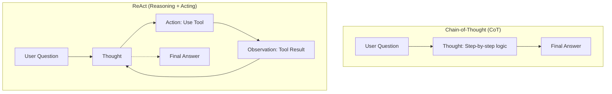

# Unit 1

## **ReAct Approach**

### 🧠 Core Concept: The "Inner Monologue"

**Thought** is the agent's internal reasoning process. It is the LLM "talking to itself" to:

1. **Analyze:** Break down complex problems into steps.
2. **Plan:** Decide what to do next.
3. **Reflect:** Adjust if the previous step failed.

Standard LLM : `Input → Output` 

no reasoning, no tool calling best for QnA

---

### 🔄 The Two Main Approaches

### 1. Chain-of-Thought (CoT) 🧘 "Pure Reasoning"

The model thinks step-by-step but stays inside its own head.

- **Formula:** `Question → Thought → Answer`
- **No Tools:** It cannot check the weather or run code.
- **Best For:** Math, logic puzzles, internal tasks.

### 2. ReAct (Reasoning + Acting) 🛠️ "Thinking & Doing"

The model alternates between thinking and using tools. This is the standard for **Agents**.

- **Formula:** `Thought → Action → Observation` (Loop)
- **Uses Tools:** It can search the web, run calculators, etc.
- **Best For:** Real-world tasks, gathering info, multi-step operations.

---

---

### 📝 Quick Comparison Table

| Feature | Chain-of-Thought (CoT) | ReAct |
| --- | --- | --- |
| **Core Mechanism** | Reasoning only | Reasoning + Tool Use |
| **Interaction** | ❌ No external tools | ✅ Yes (Actions + Observations) |
| **Structure** | Linear thought process | Cyclical loop (Think-Act-Observe) |
| **Ideal Use Case** | Math, Logic, "Brain Teasers" | Web Search, APIs, Multi-step tasks |

---

### 🧠 Examples of Common Thought Types

| Type of Thought | Example |
| --- | --- |
| Planning | "I need to break this task into three steps: 1) gather data, 2) analyze trends, 3) generate report" |
| Analysis | "Based on the error message, the issue appears to be with the database connection parameters" |
| Decision Making | "Given the user's budget constraints, I should recommend the mid-tier option" |
| Problem Solving | "To optimize this code, I should first profile it to identify bottlenecks" |
| Memory Integration | "The user mentioned their preference for Python earlier, so I'll provide examples in Python" |
| Self-Reflection | "My last approach didn't work well, I should try a different strategy" |
| Goal Setting | "To complete this task, I need to first establish the acceptance criteria" |
| Prioritization | "The security vulnerability should be addressed before adding new features" |

> Recent models like **Deepseek R1** or **OpenAI’s o1** were fine-tuned to *think before answering*. They use structured tokens like `<think>` and `</think>` to explicitly separate the reasoning phase from the final answer.
> 
> 
> Unlike ReAct or CoT — which are prompting strategies — this is a **training-level technique**, where the model learns to think via examples.
> 

---

##