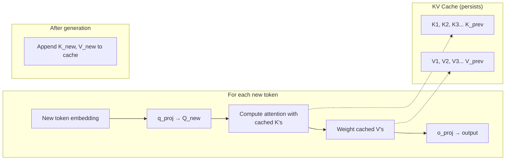

# Transformer Architecture & KV Cache Deep Dive

## 1. Inside One Transformer Block (e.g., "The quick brown fox")

### Overall Flow
- Input: Embeddings of every input token
- Multiple layers (Layer 1 → Layer N), each containing:
    - **Self-Attention**
    - **Feed-Forward Network**
- Final output passes through **LM Head**

### Components of a Transformer Block

| Sub-layer | Linear Layers |
|-----------|----------------|
| **Self-Attention** | `k_proj`, `q_proj`, `o_proj`, `v_proj` (4 layers) |
| **Feed-Forward Network** | `gate_proj`, `up_proj`, `down_proj` (3 layers) |

---

## 2. Inside Self-Attention (Step-by-Step)

### Step 1: Input Preparation
- Vector representation for token (e.g., "fox")
- Comes from: previous layer's output embedding

### Step 2: Query & Key Computation
- Generate **Q** (Query) for current token (e.g., Q4 for 4th token)
- Retrieve **K** (Keys) for all previous tokens (K1, K2, K3, K4)
- Compute **dot product** → raw scores → softmax → **Attention Scores**

### Step 3: Value Weighting
- Retrieve **V** (Values) for all tokens (V1, V2, V3, V4)
- Multiply attention scores with values → weighted output

### Step 4: Output Projection
- Pass through output projection (`o_proj`)

---

## 3. KV Cache Mechanism (Key Insight for Efficiency)

### Problem Solved
Without KV cache, every new token would recompute **K and V for all previous tokens** → O(n²) complexity.

### How KV Cache Works

**Initial prompt: "The quick brown fox"**
- Compute K and V for each token
- Save them to KV cache (via `k_proj`, `v_proj`)

**Generating next token: "jumps"**
- Compute **only Q5** for the new token
- Retrieve **K1–K4** and **V1–V4** from KV cache
- Append **K5, V5** to cache for future tokens

### Visual Representation

```
Step 1 (Initial prompt)     Step 2 & 3 (Attention)       Step 4 (Append to cache)
    [fox]                    Q4 · K1..K4                 q_proj → Q5
       ↓                         ↓                       k_proj → K5 → append
    q_proj → Q4              raw scores → softmax        v_proj → V5 → append
    k_proj → K4 → save            ↓
    v_proj → V4 → save        weighted by V1..V4
                                  ↓
                              output (via o_proj)
```

### Memory Implication (from previous notes)
- KV cache grows linearly with each new token
- 32K tokens → ~10GB memory for KV cache
- Enables parallel serving of many users (18 users with 180GB cache)

---

## 4. Key Takeaways

| Concept | Benefit |
|---------|---------|
| **KV Cache** | Avoids recomputing Keys/Values for previous tokens |
| **Cached tensors** | K and V from `k_proj` and `v_proj` layers |
| **Q computed fresh** | Each new token still needs its own Query |
| **Scales with sequence length** | Longer context → larger cache → more GPU memory |

---

## Quick Reference: Self-Attention with KV Cache

