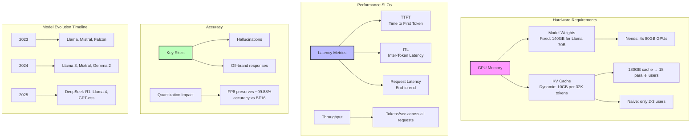
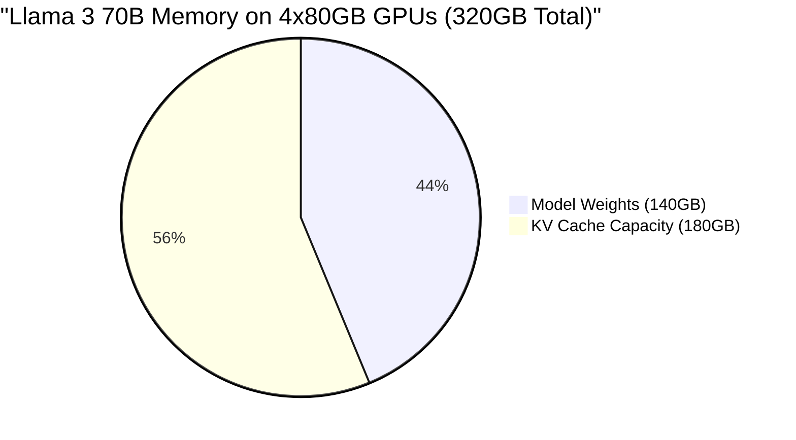
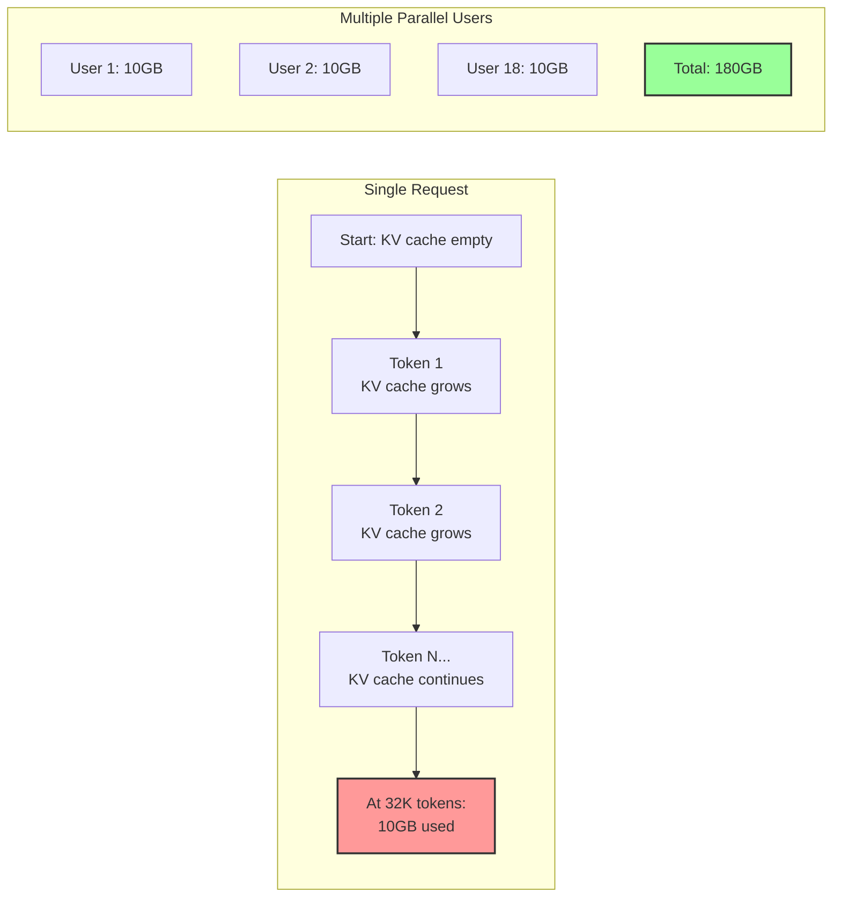
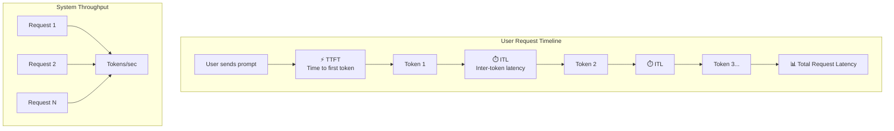
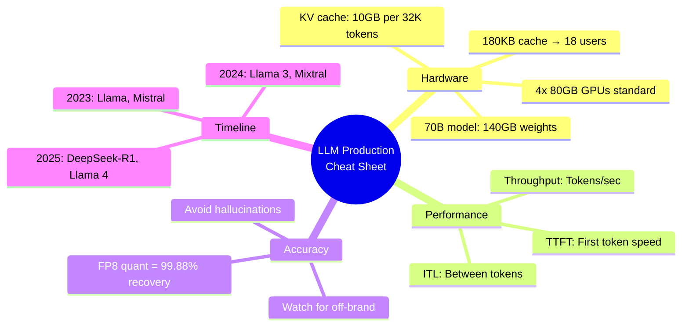

Here's a Mermaid diagram that summarizes the key concepts from your notes for quick revision:

## LLM Operations Overview

---

## GPU Memory Allocation Visual

---

## KV Cache Growth Pattern

---

## Performance Metrics at a Glance

---

## Quick Reference Card

You can copy and paste any of these Mermaid code blocks into a Mermaid-compatible viewer (like Mermaid Live Editor, GitHub, or Obsidian) to see the diagrams rendered.